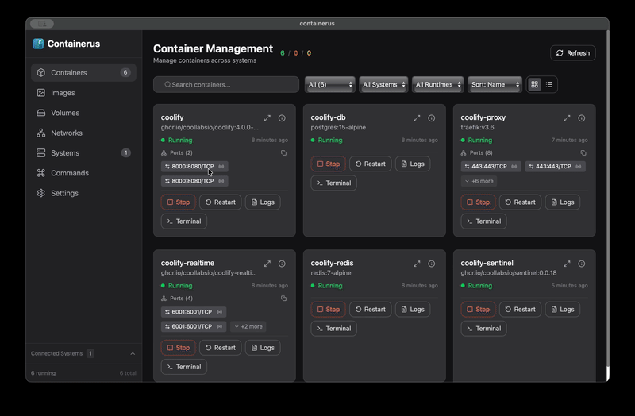
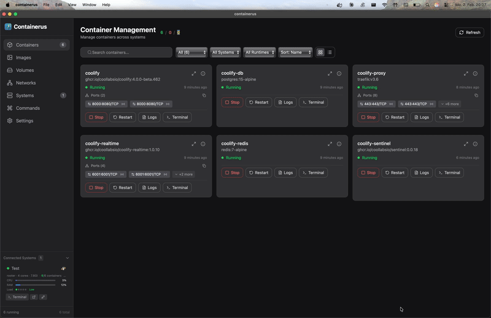
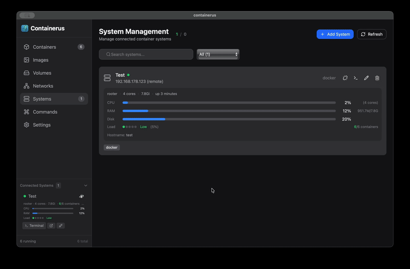

<div align="center">


# Containerus

### Your containers. One interface. AI-powered.

[](https://opensource.org/licenses/MIT)
[](https://github.com/Gatos90/Containerus/releases)
[](https://github.com/Gatos90/Containerus/releases)
[](https://github.com/Gatos90/Containerus/releases)
[](https://www.rust-lang.org)
[](https://www.typescriptlang.org)
[](https://www.docker.com)
[](https://podman.io)

**A modern container management app with built-in AI assistant.**
Manage Docker, Podman & Apple Containers — locally or via SSH.

[Download](#download) · [Features](#features) · [How It Works](#how-it-works) · [Build from Source](#building-from-source)

</div>

---

## Demo

<details open>
<summary><b>Container Overview</b></summary>

</details>

<details>
<summary><b>System Overview</b></summary>

</details>

<details>
<summary><b>Port Forwarding</b></summary>

</details>

<details>
<summary><b>Terminal & AI Assistant</b></summary>

</details>

---

## Features

| Feature | Description |
|---------|-------------|
| **Multi-Runtime Support** | Manage Docker, Podman, and Apple Container Runtime from a single unified interface |
| **AI Terminal Assistant** | Built-in AI copilot powered by Claude, OpenAI, or local Ollama models — ask questions in plain English |
| **Remote System Management** | Connect to remote servers via SSH with password or key-based authentication |
| **Container Operations** | Start, stop, restart, pause, remove containers with one click |
| **Image Management** | Pull, list, and remove container images across all your systems |
| **Volume & Network Control** | Create, inspect, and manage volumes and networks with ease |
| **Built-in Terminal** | Full PTY terminal with ANSI colors — run commands directly in any container |
| **Port Forwarding** | Forward container ports to localhost and open in browser instantly |
| **Live Monitoring** | Real-time CPU, memory, disk, and network metrics for your systems |
| **Command Templates** | Save frequently used commands and reuse them across sessions |
| **Cross-Platform** | Native apps for Windows, macOS, and Linux |

---

## AI Assistant

Containerus includes a powerful AI terminal assistant that understands your container environment:

| Capability | Description |
|------------|-------------|
| **Natural Language Commands** | Type "show me running containers" instead of remembering `docker ps` |
| **Context Awareness** | The AI knows your current directory, git branch, and recent command output |
| **Multi-Provider Support** | Choose between Claude (Anthropic), OpenAI, or local Ollama models |
| **Safety First** | Dangerous commands require confirmation — the AI warns you before risky operations |
| **Smart Suggestions** | Get intelligent command suggestions based on your query and environment |
| **Shell History** | AI can search and reference your command history for context |

---

## How It Works

1. **Connect** — Add your local system or connect to remote servers via SSH
2. **Discover** — Containerus auto-detects Docker, Podman, or Apple Container Runtime
3. **Manage** — View and control all containers, images, volumes, and networks
4. **Ask AI** — Type natural language queries to get shell commands and explanations
5. **Execute** — Run commands in the integrated terminal with full PTY support
6. **Monitor** — Watch real-time metrics and logs from your containers

---

## Download

Download the latest installers from the **[Releases Page](https://github.com/Gatos90/Containerus/releases)**.

| Platform | Architecture | Format |
|----------|--------------|--------|
| Windows | x64 | `.exe` (NSIS installer) |
| macOS | Apple Silicon | `.dmg` |
| macOS | Intel | `.dmg` |
| Linux | x64 | `.deb`, `.AppImage` |

> **[Download Latest Release](https://github.com/Gatos90/Containerus/releases/latest)**

---

## Tech Stack

<table>
<tr>
<td width="50%">

**Frontend**
- Angular 21
- TypeScript
- Tailwind CSS
- xterm.js 6.0 (terminal)
- Lucide Icons

</td>
<td width="50%">

**Backend**
- Rust
- Tauri 2.x
- SQLite
- Tokio async runtime

</td>
</tr>
<tr>
<td width="50%">

**AI/LLM**
- Rig (multi-provider framework)
- Claude API (Anthropic)
- OpenAI API
- Ollama (local models)

</td>
<td width="50%">

**Connectivity**
- russh (SSH client)
- portable-pty (terminal)
- Platform keychain (secure credentials)

</td>
</tr>
</table>

---

## Supported Container Runtimes

| Runtime | Local | Remote (SSH) |
|---------|:-----:|:------------:|
| Docker | ✓ | ✓ |
| Podman | ✓ | ✓ |
| Apple Container Runtime | ✓ | — |

---

## Building from Source

### Prerequisites

| Requirement | Windows | macOS | Linux | Notes |
|-------------|:-------:|:-----:|:-----:|-------|
| **Rust** | ✓ | ✓ | ✓ | [rustup.rs](https://rustup.rs) |
| **Node.js** | ✓ | ✓ | ✓ | v18+ recommended |
| **pnpm** | ✓ | ✓ | ✓ | `npm install -g pnpm` |
| **Visual Studio** | ✓ | — | — | "Desktop development with C++" |
| **Xcode CLI** | — | ✓ | — | `xcode-select --install` |
| **Build essentials** | — | — | ✓ | `apt install build-essential` |

### Clone & Install

```bash
git clone https://github.com/Gatos90/Containerus.git
cd Containerus
pnpm install
```

### Development

```bash
# Run in development mode with hot reload
pnpm tauri dev
```

### Production Build

<details>
<summary><b>macOS</b></summary>

```bash
./scripts/build-macos.sh <version>
```

Output: `src-tauri/target/release/bundle/dmg/*.dmg`

</details>

<details>
<summary><b>Windows</b></summary>

```powershell
./scripts/build-windows.sh <version>
```

Output: `src-tauri/target/release/bundle/nsis/*.exe`

</details>

<details>
<summary><b>Linux</b></summary>

```bash
./scripts/build-linux.sh <version>
```

Output:
- `src-tauri/target/release/bundle/deb/*.deb`
- `src-tauri/target/release/bundle/appimage/*.AppImage`

</details>

---

## Configuration

### AI Providers

Configure your preferred AI provider in **Settings**:

| Provider | Setup |
|----------|-------|
| **Claude** | Add your Anthropic API key |
| **OpenAI** | Add your OpenAI API key |
| **Ollama** | Install [Ollama](https://ollama.ai) locally — no API key needed |

### Remote Systems

Connect to remote servers via SSH:

1. Go to **Systems** → **Add System**
2. Enter hostname, port, and username
3. Choose authentication: Password or SSH Key
4. Containerus stores credentials securely in your system keychain

---

## Troubleshooting

<details>
<summary><b>Docker/Podman not detected</b></summary>

Ensure the container runtime is installed and running:
```bash
# Docker
docker --version
systemctl status docker

# Podman
podman --version
```

</details>

<details>
<summary><b>SSH connection fails</b></summary>

1. Verify the server is reachable: `ping hostname`
2. Test SSH manually: `ssh user@hostname`
3. Check firewall rules on the remote server
4. Ensure SSH key permissions are correct (`chmod 600 ~/.ssh/id_rsa`)

</details>

<details>
<summary><b>AI assistant not responding</b></summary>

1. Check your API key in Settings
2. For Ollama: ensure `ollama serve` is running
3. Verify network connectivity to the AI provider

</details>

---

## Roadmap

- [ ] Kubernetes cluster management
- [ ] Docker Compose support
- [ ] Container resource graphs
- [ ] Image build from Dockerfile
- [ ] Multi-language AI responses

---

## License

This project is licensed under the **MIT License** — see the [LICENSE](LICENSE) file for details.

---

<div align="center">

**Built with Rust, Angular, and a love for containers.**

</div>
